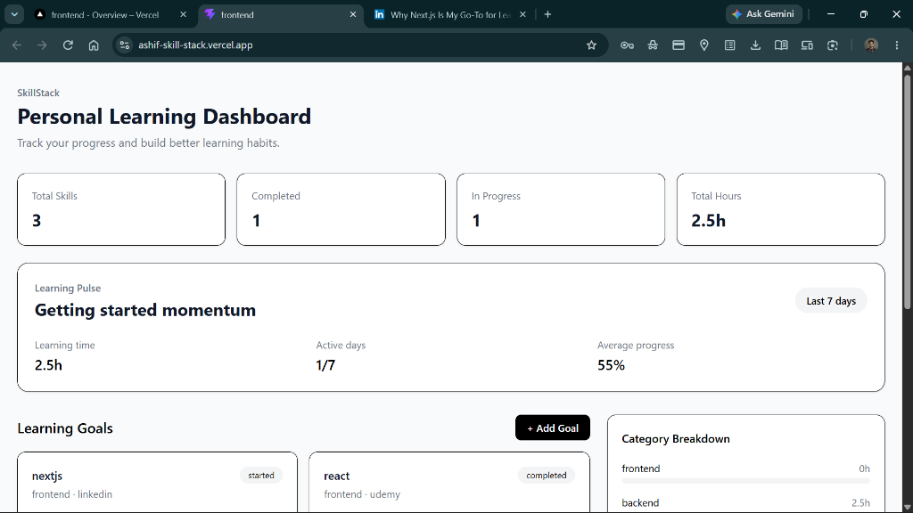
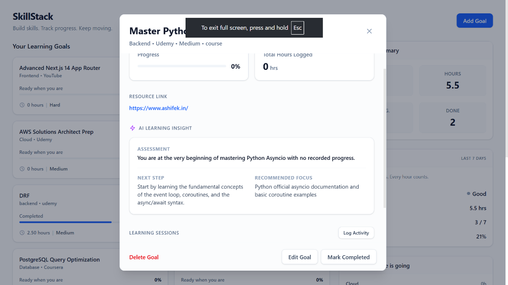
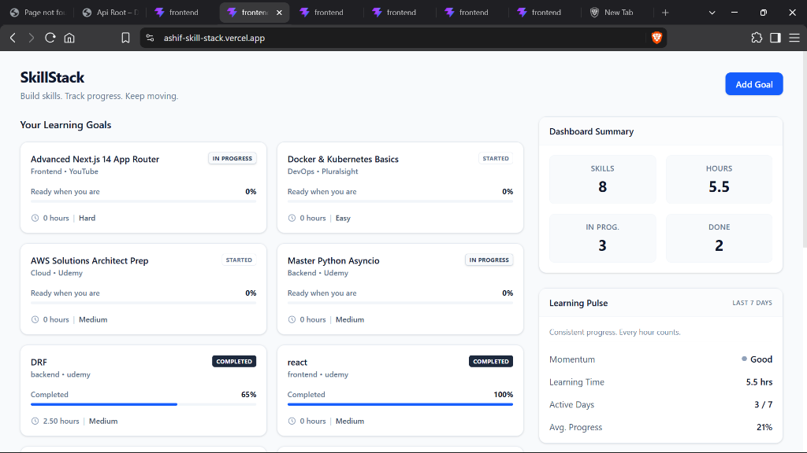

# SkillStack

SkillStack is a personal learning tracker for managing learning goals, tracking progress and learning activity, and viewing useful learning insights. It helps you stay organized and motivated by keeping a detailed log of your educational journey.

## Live Application

- **Frontend**: [https://ashif-skill-stack.vercel.app/](https://ashif-skill-stack.vercel.app/)
- **Backend API**: [https://skill-stack-production-6c9b.up.railway.app/api](https://skill-stack-production-6c9b.up.railway.app/api)
- **Docs Stack**: [https://ashif-ek.github.io/docs-stack-material/projects/github_repos/skill-stack/](https://ashif-ek.github.io/docs-stack-material/projects/github_repos/skill-stack/)

## Features

- **Create and Manage Learning Goals**: Track what you want to learn.
- **Track Progress and Status**: Keep track of the completion status (Started, In Progress, Completed) and overall progress (0-100%).
- **Detailed Goal Information**: Record resource type, platform, URL, category, difficulty, and notes for each goal.
- **Log Learning Activities**: Record individual learning sessions with specific dates, hours spent, and personal notes.
- **Dashboard Statistics**: View aggregated data including total skills, completed skills, skills in progress, and total learning hours.
- **Category-wise Learning Hours**: See a breakdown of time spent across different learning categories.
- **Recent Activity**: Quickly view your 5 most recent learning sessions.
- **Learning Pulse**: Get an overview of your momentum based on learning activity over the last 7 days.
- **AI Learning Insights**: Generates contextual, on-the-fly learning assessments and resource recommendations using the Gemini API based on a goal's progress and recent activity.
- **Responsive Frontend**: A clean and modern user interface built with React and Tailwind CSS.

## Tech Stack

### Frontend
- React
- Vite
- Tailwind CSS

### Backend
- Python
- Django
- Django REST Framework

### Database
- PostgreSQL (Neon)

## Architecture

```text
   React Frontend
        ↓
   Django REST API
        ↓
   PostgreSQL
```

- **React Frontend**: Provides a dynamic and responsive user interface for managing goals, logging activities, and viewing dashboard insights.
- **Django REST API**: Handles business logic, data validation, and serves JSON data via standard RESTful endpoints.
- **PostgreSQL**: Stores application data reliably and persistently.

## Project Structure

```text
skill-stack/
├── backend/
│   ├── config/              # Django project settings and routing
│   ├── skills/              # Main application (models, views, serializers, urls)
│   ├── manage.py            # Django command-line utility
│   └── .env                 # Environment variables (not tracked in git)
└── frontend/
    ├── public/              # Static assets
    ├── src/                 # React source code (components, pages, etc.)
    ├── index.html           # Main HTML entry point
    ├── package.json         # NPM dependencies and scripts
    ├── vite.config.js       # Vite configuration
    └── eslint.config.js     # ESLint configuration
```

## Data Model

The application revolves around two main models:

1. **LearningGoal**: Represents the current state of a skill or topic you are learning. It stores the metadata (category, difficulty, platform, resource URL) and the overall progress/status.
2. **LearningActivity**: Represents individual learning sessions logged against a specific `LearningGoal`. 

**Why are they separate?**
A goal represents the current, overall state of learning, while activities store individual, historical learning sessions. Keeping them separate makes historical tracking, aggregated analytics, and detailed time reporting possible.

## API Endpoints

### Goals
- `GET /api/goals/`: Retrieve a list of all learning goals, annotated with total hours and activity count.
- `POST /api/goals/`: Create a new learning goal.
- `GET /api/goals/<id>/`: Retrieve details of a specific learning goal.
- `PATCH /api/goals/<id>/`: Update a specific learning goal partially.
- `DELETE /api/goals/<id>/`: Delete a specific learning goal.
- `GET /api/goals/<id>/insight/`: Fetch an AI-generated learning insight and recommended next steps for a specific goal.

### Activities
- `GET /api/activities/`: Retrieve a list of all learning activities.
- `POST /api/activities/`: Log a new learning activity.
- `GET /api/activities/<id>/`: Retrieve details of a specific learning activity.
- `PATCH /api/activities/<id>/`: Update a specific learning activity partially.
- `DELETE /api/activities/<id>/`: Delete a specific learning activity.

### Dashboard
- `GET /api/dashboard/`: Retrieve aggregated dashboard statistics, including total stats, learning pulse, category breakdown, and recent activity.

The backend requires a `DATABASE_URL` environment variable to connect to the PostgreSQL database, and a `GEMINI_API_KEY` for the AI Learning Insights.

Create a `.env` file in the `backend/` directory:

```env
DATABASE_URL=postgresql://<user>:<password>@<host>/<dbname>
GEMINI_API_KEY=your_google_gemini_api_key
```
*Note: Never commit real credentials or API keys to version control.*

## Local Setup (Windows)

### Backend Setup

1. Open a terminal and navigate to the backend directory:
   ```cmd
   cd skill-stack\backend
   ```
2. Create and activate a virtual environment:
   ```cmd
   python -m venv venv
   .\venv\Scripts\activate
   ```
3. Install dependencies:
   ```cmd
   pip install Django djangorestframework psycopg-binary dj-database-url django-cors-headers python-dotenv
   ```
4. Configure your `.env` file with the `DATABASE_URL` as shown in the Environment Variables section.
5. Run database migrations:
   ```cmd
   python manage.py migrate
   ```
6. Start the Django development server:
   ```cmd
   python manage.py runserver
   ```

### Frontend Setup

1. Open a **separate terminal** and navigate to the frontend directory:
   ```cmd
   cd skill-stack\frontend
   ```
2. Install npm dependencies:
   ```cmd
   npm install
   ```
3. Start the Vite development server:
   ```cmd
   npm run dev
   ```

## Dashboard Explanation

The dashboard provides a comprehensive view of your learning journey by aggregating data into:
- **Total Skills**: The number of learning goals tracked.
- **Completed / In Progress**: A breakdown of goal statuses.
- **Total Hours**: Cumulative time spent across all learning activities.
- **Category Breakdown**: A summary of learning hours grouped by category.
- **Recent Activity**: A quick glance at your 5 latest learning sessions.
- **Learning Pulse**: An assessment of your learning momentum over the last 7 days, including active days and weekly hours.

## Engineering Decisions

- **PostgreSQL from Development to Production**: PostgreSQL is used locally (e.g., Neon) to avoid database differences and subtle bugs that can occur when switching from SQLite to PostgreSQL.
- **Separate Models for Goal and Activity**: Distinguishing between `LearningGoal` and `LearningActivity` enables rich historical analytics and accurate tracking of time spent over time.
- **ModelViewSet**: Used Django REST Framework's `ModelViewSet` to provide standard, fully-featured CRUD operations for goals and activities with minimal boilerplate code.
- **Aggregated Dashboard Endpoint**: A dedicated `/api/dashboard/` endpoint aggregates all necessary statistics and metrics on the backend, reducing the number of requests the frontend needs to make and moving complex data aggregation to the database layer where possible.

## Validation / Error Handling

- **Goal Progress**: Progress percentage is strictly validated to be between 0 and 100 using Django's `MaxValueValidator(100)`.
- **Activity Hours**: Logged hours must be zero or a positive value, enforced by `MinValueValidator(0)`.

## Future Improvements

The following features are ideas for future development and are **not currently implemented**:
- Authentication and user accounts
- Mastery-date prediction based on learning velocity
- Automated weekly learning summaries

## Demo

[Demo video](ADD_DEMO_LINK_HERE)

## Screenshots

### Dashboard

*The main SkillStack dashboard tracking learning pulse and goals.*

### Goal Details & AI Insights

*Context-aware AI insight generated for a completed goal.*


*Detailed view of a learning goal with its AI assessment.*
